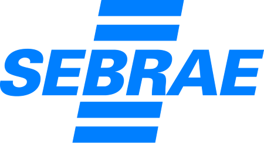

:auto-console: true
:title: Inner-sourcing - adotando práticas de desenvolvimento de software livre em uma empresa ou órgão
:author: Alexandre Drummond
:keywords: open-source, inner-sourcing, agile, lean, devops, tools
:css: css/apresentacao.css
:skip-help: false
:data-transition-duration: 1250

Inner-sourcing - adotando práticas de desenvolvimento de software livre em uma empresa ou órgão
===============================================================================================

.. class:: right

Por Alexandre Drummond

----

:id: eu

Doncovim, oncotô
----------------

+------------------------------+----------------------------------------------------------------------+
| .. image:: images/avatar.jpg | Profissional de TI a mais de 30 anos (15/10/1986), desenvolvedor     |
|                              | Java desde 1997, Python desde 1999, profissional de gestão de        |
|                              | configuração desde 2000, sempre devops, mesmo antes do termo existir |
+------------------------------+----------------------------------------------------------------------+

Iniciei na |prodemge|; a mais de 25 anos na |prodabel| e depois |saogeraldo|; a mais de 20 anos na |vb|, que me permitiu prestar serviços à |fiat|, |fumsoft| (que voltei no sec. XXI), |newholland|, |sebraemg|, entre outras. Dei aulas no sistema |fiemg| e sai por uns tempos de BH para trabalhar na |webmind|. Ao retornar fiquei um bom tempo no |bdmg| e |serpro|, onde pude trabalhar no |siafi| e |sigepe|. Hoje estou no |trtmg|.

.. |newholland| image:: images/logos/logo-new-holland.png
    :width: 100px

.. |webmind| image:: images/logos/logo-webmind.gif

----

O que é inner-sourcing?
=======================

OPEN SOURCE tem tido um enorme impacto na área de TI. Enquanto parte da indústria de software adota amplamente software open source (OSS) de variadas maneiras, mas primariamente como produtos em sua infraestrutura, inúmeras organizações tem adotado, no desenvolvimento e entrega de produtos, práticas open source. Essas práticas evoluiram para o que chamamos hoje de INNER SOURCING.

----

O que é inner-sourcing?
=======================

O termo foi criado por Tim O'Reilly em 2001, mas o conceito existe a mais tempo:

----

O que é inner-sourcing?
=======================

"É a adoção do paradigma de desenvolvimento open source dentro de uma organização"

----

:data-y: r1000

Que benefícios que pode trazer a uma organização, seja empresa ou órgão?
========================================================================

- Aumento de reuso/compartilhamento de código entre equipes

- Melhoria na qualidade do código

- Inovação com risco reduzido

- Desenvolvimento acelerado

- Melhoria na mobilidade de desenvolvedores entre equipes que fazem uso de inner-sourcing e melhor gestão de conhecimento dessas equipes

- Melhores processos de trabalho para desenvolvimento de software com equipes geograficamente distribuidas

----

:data-rotate: 90

Que padrões são esses? Como são implementados?
==============================================

Klaas-Jan Stol e Brian Fitzgerald definiram **9 padrões ou fatores** relacionados a **3 categorias**: *o produto desenvolvido* utilizando o modelo de inner-source ('o que'), *as práticas e ferramentas* ('como'), e *pessoas e gestão* (o 'quem' e 'onde')

----

:data-x: r0
:data-y: r5500
:data-scale: 0.1

Os Nove Fatores
===============

Grupos:

- Adequação do Produto

- Práticas e Ferramentas

- Pessoas e Gestão

----

:data-x: r1600

Adequação do Produto
====================

1. O produto piloto (para atrair uma comunidade)

2. As partes interessadas (múltiplas, para variedade nas contribuições)

3. Modularidade (para atrair usuário e colaboradores)

.. note::
  
  1. O produto piloto (para atrair uma comunidade)
    
    - Recomendações:
    
      - Achar um produto que implementa funcionalidades comuns a mais de 
        um projeto/produto de software ou um padrão
    
    - Riscos:
    
      - Adotar inner-sourcing em um projeto com um conjunto muito grande
        de requisitos a ser implementado já no primeiro release 

  2. As partes interessadas (múltiplas, para variedade nas contribuições)
    
    - Recomendações:
    
      - Identificar um produto piloto que tenha diferentes stakeholders
        para criar uma comunidade de usuários e desenvolvedores grande o
        suficiente para que o interesse em manter o projeto com qualidade
        cresça
    
    - Riscos:
      
      - Como o número de stakeholders é maior, diferenças de opinião
        podem influenciar negativamente o projeto   
  
  3. Modularidade (para atrair usuário e colaboradores)
    
    - Recomendações:
      
      - Prestar atenção extra na modularidade do projeto piloto, pois 
        pode interferir com a facilidade de contribuição no projeto
      
    - Riscos:
      
      - Módulos muito grandes podem dificultar a colaboração. o produto
        não deve assumir muito sobre o ambiente onde está sendo executado,
        quanto menos dependências de runtime ele tiver empacotados dentro
        do produto melhor

----

:data-x: r1000

Práticas e Ferramentas
======================

4. Práticas de desenvolvimento (para facilitar um estilo de desenvolvimento Bazar)

5. Garantia da qualidade (práticas para possibilitar um estilo de controle de qualidade do tipo Bazar)

6. Ferramentas de desenvolvimento (ferramentas padronizadas que facilitem a colaboração)

.. note::
  
  4. Práticas de desenvolvimento (para facilitar um estilo de desenvolvimento Bazar)
    
    - Recomendações:
      
      - Utilizar um processo que facilite e encoraje a colaboração e
        considerar as limitações do projeto e da organização
    
    - Riscos:
      
      - Caso o projeto seja muito complexo, a colaboração pode se tornar
        pouco interessante para alguns stakeholders

  5. Garantia da qualidade (práticas para possibilitar um estilo de controle de qualidade do tipo Bazar)
    
    - Recomendações:
      
      - Investir no suporte a "early adopters", procurando resolver
        rapidamente os problemas encontrados por eles. Criar padrões de
        qualidade que possam ser verificados rapidamente ao receber 
        colaboração de código
    
    - Riscos:
      
      - Se membros da comunidade não participarem na verificação de 
        qualidade do código, a qualidade tende a diminuir e problemas
        podem não ser identificados a tempo de serem corrigidos de forma
        fácil e rápida
  
  6. Ferramentas de desenvolvimento (ferramentas padronizadas que facilitem a colaboração)
    
    - Recomendações:
      
      - Garantir a disponibilidade de ferramentas adequadas
    
    - Riscos:
      
      - Adotar um novo conjunto de ferramentas pode inicialmente afetar
        a produtividade das equipes

----

:data-x: r1000

Pessoas e Gestão
================

7. Coordenação e liderança (para suportar meritocracia)

8. Transparência (para uma gestão mais aberta da colaboração)

9. Apoio e motivação por parte da gerência (para envolver as pessoas)

.. note::

  7. Coordenação e liderança (para suportar meritocracia)
    
    - Recomendações:
      
      - Reconheçer a propriedade (ownership) dos criadores do projeto.
        De acordo com que o projeto cresce em importância e comunidade, 
        viabilizar estruturas de gestão e gestão que possibilite a 
        manutenção do interesse da comunidade
    
    - Riscos:
      
      - Conflitos sobre quem irá liderar os esforços do projeto poderão
        surgir
  
  8. Transparência (para uma gestão mais aberta da colaboração)

    - Recomendações:
      
      - Dar acesso ao código fonte para encorajar revisão de código e
        sugestões de melhoria. Disponibilizar uma wiki para compartilhamento
        de conhecimento e uma lista de discussão que possa ser facilmente
        pesquisada
    
    - Riscos:
      
      - Gestores e desenvolvedores podem se sentir desconfortáveis em 
        compartilhar o código do projeto, seja pelo medo de perder o 
        controle do desenvolvimento do produto, seja pelo medo de ser 
        julgado por suas contribuições. 
  
  9. Apoio e motivação por parte da gerência (para envolver as pessoas)
    
    - Recomendações:
      
      - Trabalhar em conjunto com a gestão para que o projeto mantenha sua
        natureza mais flexível, ajudando a manter o interesse da comunidade
        formada em continuar colaborando. Tentar incluir o usuário na manutenção
        da comunidade
    
    - Riscos:
      
      - Se a gestão ligada a cada colaborador frequentemente muda a priorização
        do envolvimento do colaborador no projeto, o risco do colaborador parar
        de colaborar de forma eficaz aumenta, podendo prejudicar a sustentabilidade
        de um projeto dessa natureza
      
----

:id: ThreeD
:data-y: r5600
:data-rotate-x: 90

Que relação inner-sourcing tem com Agile Software Development e Lean Software Development?
==========================================================================================

Não existe uma ligação estrita, mas as comunidades de software livre e inner sourcing adotam 
práticas ágeis e lean para reduzir muitos dos riscos relacionados a práticas e ferramentas e 
também à adequação do produto.

----

:data-x: r0
:data-y: r-1600

Por que desenvolvedores se interessariam em participar de um projeto utilizando práticas inner-source?
======================================================================================================

- Papeis: Desenvolvedores principais, colaboradores, comunidade de usuários

- Ferramentas: VCS e SCM (Gitlab, Bitbucket, GitHub), Bug Tracking (JIRA, GitLab, RedMine),
  Project Website (Redmine, Gitlab), Mailing Lists/Message Forums (IBM Versa, Slack), 
  Continuous Integration (ThoughtWorks Go, GitLab-CI, Travis, Jenkins, Apache Continuum)

----

Por que desenvolvedores se interessariam em participar de um projeto utilizando práticas inner-source?
======================================================================================================

Quém é o dono do código fonte?

- Proibição de uso de versões não oficiais em produção

- Controle do versionamento do release

- Política de uso de Tags e branches

- Política de Packaging e release notes

- Anunciando releases

----

:data-rotate-y: 180
:data-scale: 3
:data-x: r-1500
:data-y: r500

Curva de adoção tecnológica e custos de adoção de novas tecnologias
===================================================================

----

:data-x: r1500
:data-y: r-800
:data-z: r4000

Curva de "hype" de novas tecnologias
====================================

.. image:: images/hype-cycle.svg

----

:data-x: r-3000
:data-scale: 1

Culture and mindset
===================

- Show me proof: “We’ve failed at this in the past. Before I open up for contributions or reuse code, I want to see success stories that prove this can be done.”

- Not invented here: “We trust our team and our code. We haven’t worked with you to establish trust. Your code might be sketchy and break our build.”

- Wizard-itis: “Your contributions could never reach my caliber. I don’t want your code and I’m not going to spend my valuable time mentoring you.”

----

:data-y: r-1200

Organizational silos and team structure
=======================================

- Silos: “We do intra-team collaborative development within our domain.”

- Structure: “We are not set up to do this. We don’t have team members dedicated to review code from contributors outside of our team nor to mentor them.”

----

:data-y: r-1200

Constraints
===========

- “It’s faster if we write it ourselves/rewrite it.”

- “I haven’t contributed because I don’t have time to get my code into the state that would be needed to enable others to consume it.”

- “Who ultimately owns and supports an open sourced component? I can’t contribute to it if I’m then expected to own and support it.”

- “I can’t contribute to others projects because I have limited knowledge outside of my technology area.”

- “I found code for the functionality that I’m looking for, but it does not embed into my product. It’s not reusable out-of-the-box.”

----

:data-y: r-1200

Discoverability Issues
======================

- “I searched for the code that I wanted to reuse/contribute to and didn’t find it, so I never went back.”

----

:data-y: r-1200

Security Concerns
=================

- “How can we ensure that our IP and third-party licensed IP remains secure?”

----

:data-x: r-2000
:data-y: r2500
:data-z: r4000
:data-rotate-x: r90

Twelve Factor Apps
==================

I. Codebase
-----------

One codebase tracked in revision control, many deploys

----

:data-y: r-200

Twelve Factor Apps
==================

II. Dependencies
----------------

Explicitly declare and isolate dependencies

----

:data-y: r-200

Twelve Factor Apps
==================

III. Config
-----------

Store config in the environment

----

:data-y: r-500

Twelve Factor Apps
==================

IV. Backing services
--------------------

Treat backing services as attached resources

----

:data-y: r-500

Twelve Factor Apps
==================

V. Build, release, run
----------------------

Strictly separate build and run stages

----

:data-y: r-500

Twelve Factor Apps
==================

VI. Processes
-------------

Execute the app as one or more stateless processes

----

:data-y: r-500

Twelve Factor Apps
==================

VII. Port binding
-----------------

Export services via port binding

----

:data-y: r-500

Twelve Factor Apps
==================

VIII. Concurrency
-----------------

Scale out via the process model

----

:data-y: r-500

Twelve Factor Apps
==================

IX. Disposability
-----------------

Maximize robustness with fast startup and graceful shutdown

----

:data-y: r-500

Twelve Factor Apps
==================

X. Dev/prod parity
------------------

Keep development, staging, and production as similar as possible

----

:data-y: r-500

Twelve Factor Apps
==================

XI. Logs
--------

Treat logs as event streams

----

:data-y: r-500

Twelve Factor Apps
==================

XII. Admin processes
--------------------

Run admin/management tasks as one-off processes

----------------------------------------------------------------

:data-x: 0
:data-y: r2500
:data-z: r4000
:data-rotate-x: r90

Organizações com razoável experiência com inner-sourcing
========================================================

- Lucent, Hewlett-Packard, IBM, Microsoft, Nokia, SAP, RedHat, Google

- Paypal, Bosh, Rolls Royce, Walmart, Philips

- Governo Britânico, US Departament of Defense

----

:data-scale: 5
:data-rotate: r90
:data-x: r3000
:data-y: r1000

Considerações finais
====================

Success requires buy-in and investment from all levels (top down, middle management, and grassroots). It is important that all understand the principles and benefits driving the program, and support and enable the behavior changes that must come along with it.

Engineering teams must be empowered and enabled to find opportunities for reuse and for making contributions, in a safe and transparent environment.

The Engineering role must include strong focus on code reviews, mentoring, and open, documented communication.

Companies must focus on the right metrics. While many are focused on activity metrics such as volume of commits, pull requests, etc., the community has raised go-to-market time as the metric that really matters (reuse and collaboration lead to this).

Common components need to be easily consumable.

----

:data-scale: 5
:data-rotate: r90
:data-x: r3000
:data-y: r1000
:id: referencias

Referências
===========

- `innersourcing.com <http://www.inner-sourcing.com/>`_

- `O'Reilly <https://www.oreilly.com/ideas/using-open-source-methods-for-internal-software-projects>`_

- `scalare.org <http://scalare.org/wp-content/uploads/2015/06/software-sourcing-in-the-age-of-open.pdf>`_

- `blog.blackducksoftware.com <http://blog.blackducksoftware.com/inner-sourcing-adopting-open-source-development-processes-in-corporate-it/>`_

- `blogs.ca.com <http://blogs.ca.com/2017/02/02/innersource-challenges-keys-success/>`_

- `ACM Trans. Software Eng. Methodol. <http://www.inner-sourcing.com/wp-content/uploads/2015/11/ACM-Trans.-Softw.-Eng.-Methodol.-2014-Key-factors-for-adopting-inner-source.pdf>`_

- `The Twelve-Factor App <https://12factor.net/>`_

- Para quem tem acesso aos artigos do `IEEE <https://www.computer.org/csdl/mags/so/2015/04/mso2015040060-abs.html>`_

- `MATERIAL ORIGINAL <https://github.com/zandao/apresentacao-inner-sourcing>`_

----

:data-scale: 1
:data-x: r4000
:data-y: r2000

FIM
===

|
|
|

Contato
-------

|
|
|

----

:data-scale: 4
:data-rotate: r90
:data-x: r3000
:data-y: r2000

This work is licenced under a `Creative Commons Attribution-Non-Comercial-ShareAlike 4.0 International Licence <http://creativecommons.org/licenses/by-nc-sa/4.0/>`_.

Esta apresentação se encontra no GitHub em `https://github.com/zandao/apresentacao-inner-sourcing <https://github.com/zandao/apresentacao-inner-sourcing>`_.
